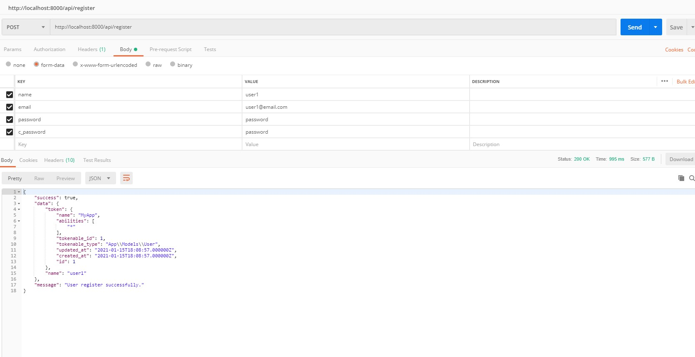
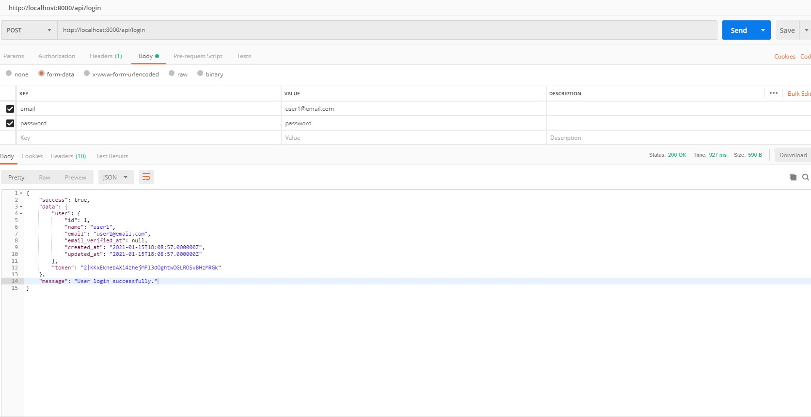
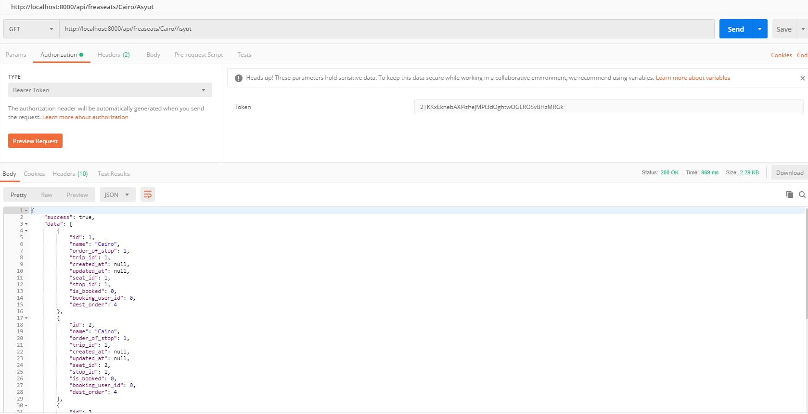
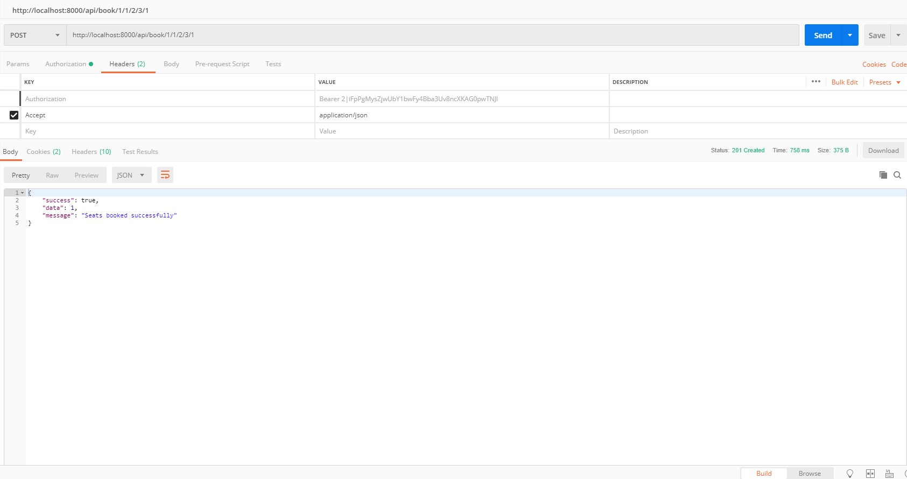

# Fleet Management System

#### This task requires having MySQL Command Line Interface application or any server (for exmple myphpadmin) to create the database and populate the tables. It also requires having installed PHP8.0.1 and Composer to run the commands. Please make sure to install all of those before attempting the following steps.
#

## Steps to run this project:

1. Download a zipped version of this repo and unzip it in a new folder.
2. Run the following command in terminal inside the unzipped folder
```shell session
composer install
```
3. In the MySQL CLI, create a new database using the following command where `database_name` can be changed to any other name 
```sql
CREATE DATABASE database_name
```
4. Duplicate the `.env-example` and rename it to `.env`
5. In the new `.env` file change the `DB_DATABASE` environment variable to the name of the database you created. You might need to enter the username and password of the MySQL server if you set them up, if not leave them as is.
6. Back in the terminal, run the following command
```shell session
php artisan migrate
```
7. To dump the data into the database, first edit the file `sql_dump.sql` by changing the database name in the `USE` statement to your database name. Then in the MySQL CLI run the following command. You might need to write the full path to the SQL file.
```sql
source sql_dump.sql
```
8. Finally, in the terminal (again) run the following command to run the application
```shell session
php artisan serve
```
#

## Testing the APIs in Postman

#### In all the following API calls, make sure to add the following header: `accept: application/json`

1. First, we will register a user.



2. Next we will login with the same user to obtain the access token used for authenticating the user.



3. After copying token supplied in the http response we will test the first API which retrieves all free seats between 2 stops. The URI is http://localhost:8000/api/freaseats/Cairo/Asyut where `Cairo` is the start and `Asyut` is the destination. Notice that in the Authorization tab in Postman, Bearer Token is selected and the Access Token is inserted on the right. If a wrong token is used, the API call will return `unauthenticated`.



4. For the second API, we will repeat the step of inserting the token and the URL is http://localhost:8000/api/book/1/1/2/3/1 where the numbers are the user ID, trip ID, start stop order in trip, destination stop order in trip and seat ID respectively. All this data can be retrieved from the login and freeseats API calls and should usually be handled by the frontend. For now the data is manually inserted. This call in plain English attempts to book seat number 1 in trip number 1 (from Cairo to Asyut) from stop AlFayyum to stop AlMinya. Sending the same API call again will return an error that the seats are already booked. An interesting case to try is http://localhost:8000/api/book/1/1/1/4/1

